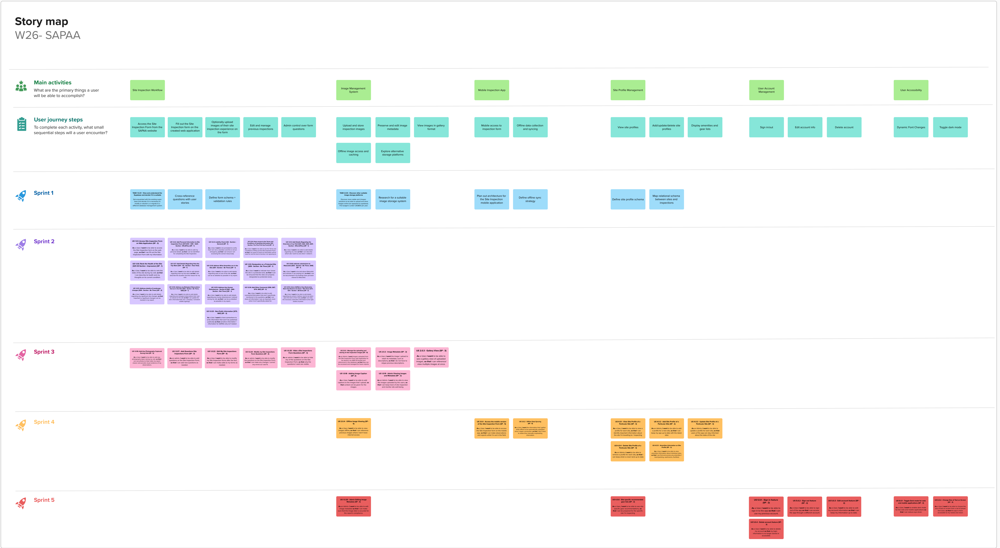

# Project Management

This page provides a general overview of the assigned tasks and roles for the duration of five sprints (subject to change).

## Story Map
[View the Story Map on MURAL](https://app.mural.co/t/w26sapaa5191/m/w26sapaa5191/1769738797979/50f464dfdeaa98350a875ad25dff2f1a613ea7a3?sender=ubcb7600326dec09377448403)

## Project Plan

**Project Scrum Master:** Jason Liang

**Project Product Owner:** Harveer Deol

### Sprint 1
**Due:** *February 1, 2026*

#### Tasks

|Task|Related US|Assignee|Due|
|:---:|:---:|:---:|:---:|
|User Stories                                   |Documentation  |Everyone                       |Jan 30th|
|Project Requirements Doc                       |Documentation  |Raiyana                        |Jan 30th|
|Architecture Diagram                           |Documentation  |Vishal, Braden                 |Jan 30th|
|UML Diagram                                    |Documentation  |Braden                         |Jan 30th|
|Sequence Diagram                               |Documentation  |Vishal                         |Jan 31st|
|User Interface Mockup                          |Documentation  |Jason, Akib, Braden            |Jan 31st|
|Software Design Doc                            |Documentation  |Raiyana                        |Feb 1st |
|Project Management Doc                         |Documentation  |Jason, Raiyana, Vishal         |Feb 1st |
|Team Canvas                                    |Documentation  |Everyone                       |Jan 31st|
|Teamwork Doc                                   |Documentation  |Jason                          |Jan 31st|
|Research and evaluate image management options |TASK 2.0.5     |Harveer, Zoe, Akib, Raiyana    |Jan 29th|
|Understand the previous project database       |TASK 1.0.21    |Harveer, Jason, Vishal, Braden |Jan 27th|

### Sprint 2

**Due:** *February 14, 2026*

#### User stories

|User Story|Story points|
|:---:|:---:|
|US 1.0.1 – Access Site Inspection Form on Web Application|3|
|US 1.0.2 – Add Personal Information to Site Inspection Form [Q11-Q14 + Q16 + Q24 - Section : WhoRYou]|1|
|US 1.0.3 - Liability Check [Q2 - Section : General]|1|
|US 1.0.4 - Have access to the Terms and Conditions of Inputting Information [Q3 - Section: The Fine Print Up Front]|1|
|US 1.0.5 - Add Details Regarding the Overview of my Visit [Q21, Q22, Q23, Q25 - Section : WhereRYou] |1|
|US 1.0.6 - Rank the Health of the Site [Q31-33 Section : Impression]|1|
|US 1.0.7 - Add Details Regarding How the Trip Went [Q41 - 43 - Section : How Visit]|1|
|US 1.0.8 - Address What Amenities are in the Site [Q51 : Section - Be There]|1|
|US 1.0.9 - Designation as a Protected Site [Q55 - Section : Be There]|1|
|US 1.0.10 - Indicate submissions to iNaturalist [Q53 - Section : Be There, Q68]|1|
|US 1.0.11 - Address details of Landscape changes [Q54 - Section : Be There]|2|
|US 1.0.12 - Address any Biological Observations that are in the Site [Q52 - Section : Be There, Q68]|1|
|US 1.0.13 - Address Any Human Disturbances - Section 8 [Q61 - Q66 - Section : Not There]|1|
|US 1.0.14 - Add Other Comments [Q56, Q67, Q74, Q82]|2|
|US 1.0.15 - Inform SAPAA of Any Restorative Work that Needs to be Done / Was Done [Q71, Q72 - Section : 2B Done]|2|
|US 1.0.23 - Non-Public Information [Q73, Q83]|2|

**Sprint Velocity:** 22

#### Tasks

|Task|Related US|Assignee|Due|
|:---:|:---:|:---:|:---:|
|Build the Site Inspection Form entry point|US 1.0.1|Vishal, Jason, Raiyana|Feb 7th|
|Add the liability check and access gate|US 1.0.3|Harveer|Feb 8th|
|Add the Terms & Conditions acceptance flow|US 6B.01|Harveer|Feb 8th|
|Create the personal information section|US 1.0.2|Braden|Feb 11th|
|Create the visit overview and site selection section|US 1.0.5|Vishal|Feb 11th|
|Add the non‑public information fields|US 1.0.23|Harveer|Feb 11th|
|Develop the site health and impression section|US 1.0.6|Zoe|Feb 11th|
|Develop the trip details and visit reasoning section|US 1.0.7|Braden|Feb 11th|
|Add the landscape change reporting fields |US 1.0.11|Braden|Feb 11th|
|Add the biological observations section|US 1.0.12|Jason|Feb 11th|
|Add the human disturbances reporting section|US 1.0.13|Zoe|Feb 11th|
|Create the amenities and ease‑of‑use section|US 1.0.8|Akib|Feb 11th|
|Create the protected site designation section |US 1.0.9|Akib|Feb 11th|
|Add the iNaturalist submission indicator|US 1.0.10|Akib|Feb 11th|
|Add the additional comments and free‑text section|US 1.0.14|Vishal, Raiyana|Feb 11th|
|Add the restoration actions and stewardship section|US 1.0.15|Zoe|Feb 12th|
|Assemble all sections into a unified form schema |All US|Everyone|Feb 14th|
|Finalize the submission flow and validation logic |All US|Everyone|Feb 14th|
|Write acceptance tests|All US|Everyone|Feb 14th|
|Update documentation|Documentation|Everyone|Feb 14th|

**Sprint Velocity:** 26

### Sprint 3

**Due:** *March 8, 2026*

#### User stories

|User Story|Story points|
|:---:|:---:|
|US 1.0.16 – Add Any Photography Captured During Visit|5|
|US 1.0.17 – (Admin) Add Questions Site Inspections Form|3|
|US 1.0.18 – Adding Image Caption|2|
|US 1.0.19 - Admin Viewing Images and Metadata|2|
|US 1.0.22 – (User) Edit My Site Inspections Form|5|
|US 1.0.24 – Modify my Site Inspections Form Questions|3|
|US 1.0.25 – Hide a Site Inspections Form Questions|3|
|US 2.0.1 – Manage the uploading and storing of site inspection images|8|
|US 2.0.2 – Image Metadata|2|
|US 2.0.3 – Gallery View|3|

**Sprint Velocity:** 36

### Sprint 4

**Due:** *March 22, 2026*

#### User stories

|User Story|Story points|
|:---:|:---:|
|US 2.0.4 – Offline Image Viewing|5|
|US 3.0.1 – Access the mobile version of the Site Inspection Form|5|
|US 3.0.2 – Offline Data Syncing|8|
|US 4.0.1 – View Site Profile of a Particular Site|3|
|US 4.0.2 – Add Site Profile of a Particular Site|2|
|US 4.0.3 – Update Site Profile of a Particular Site|3|
|US 4.0.4 – Delete Site Profile of a Particular Site |3|
|US 4.0.5 – Amenities Information on Site Profile|2|

**Sprint Velocity:** 31

### Sprint 5

**Due:** *March 31, 2026*

#### User stories

|User Story|Story points|
|:---:|:---:|
|US 1.0.20 – Admin Editing Image Metadata|3|
|US 4.0.6 – Site-specific Recommended Gear Lists|2|
|US 5.0.1 – Sign In Feature|2|
|US 5.0.2 – Sign Out Feature|2|
|US 5.0.3 – Edit Account Feature|2|
|US 5.0.4 – Delete Account Feature|2|
|US 6.0.1 – Toggle Dark mode for web and mobile applications|2|
|US 6.0.2 – Change Text Size on Screen|3|

**Sprint Velocity:** 18
