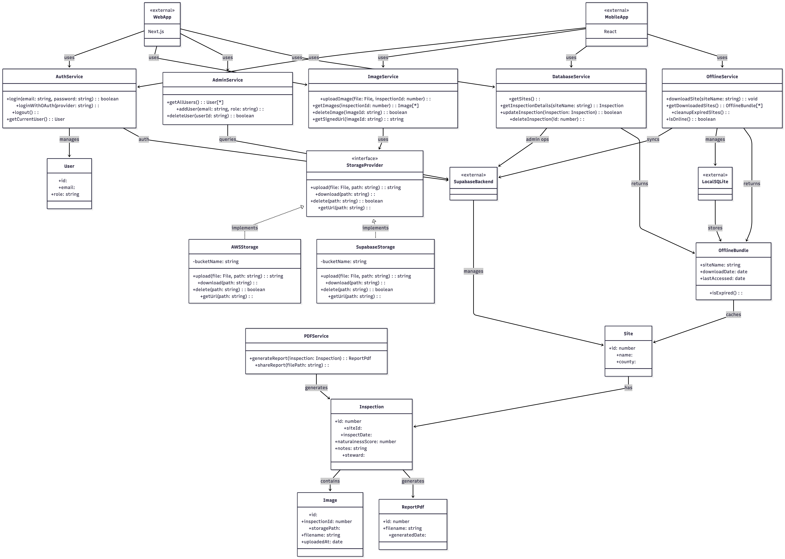
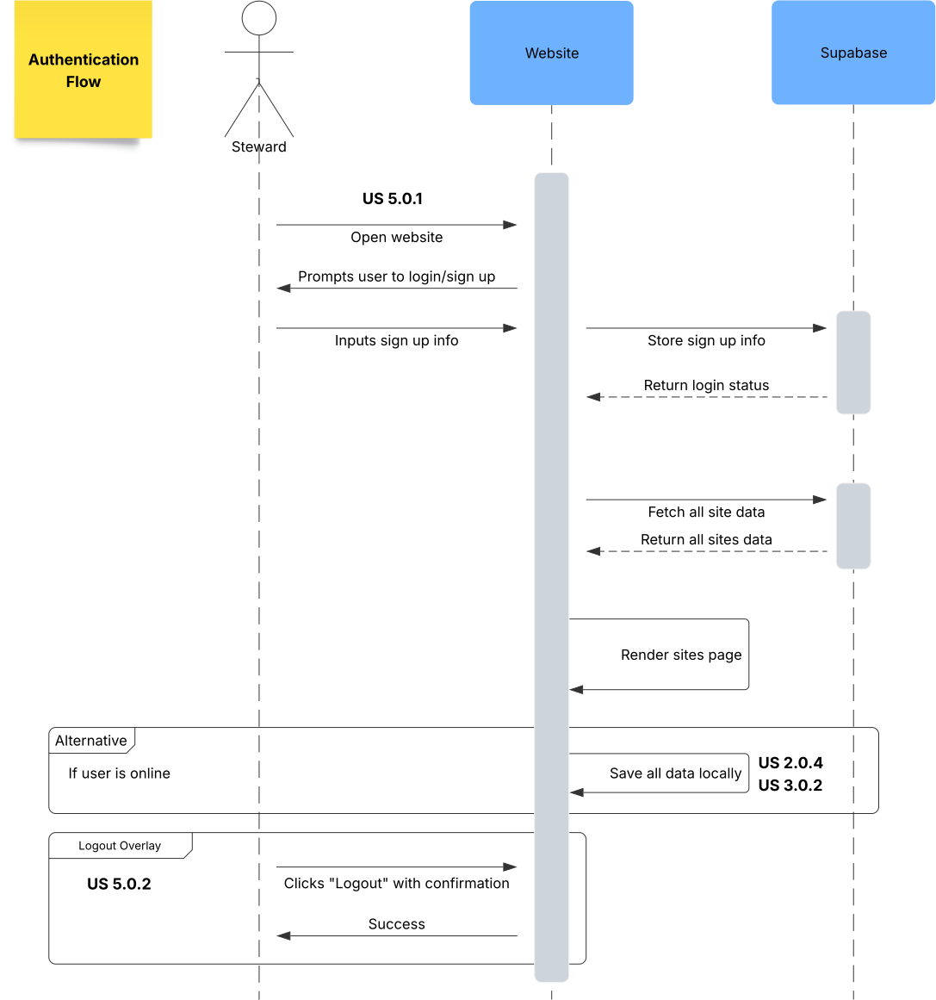
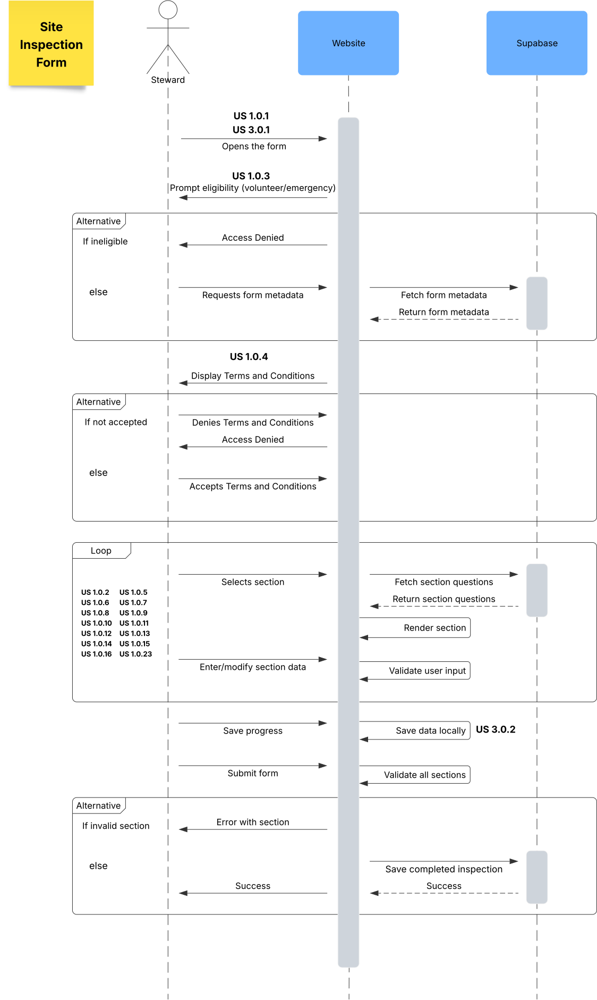
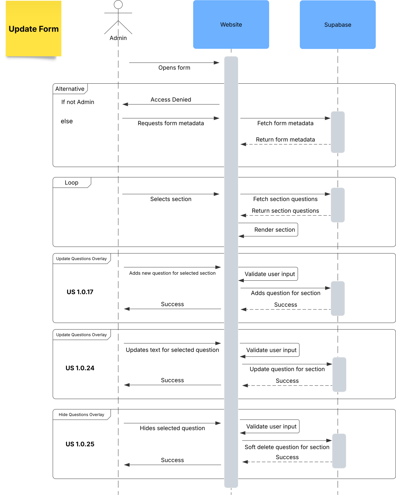
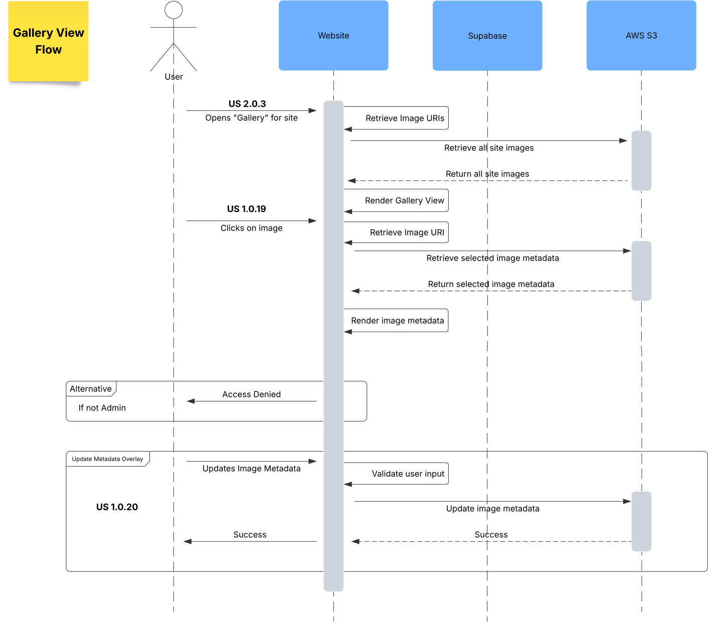
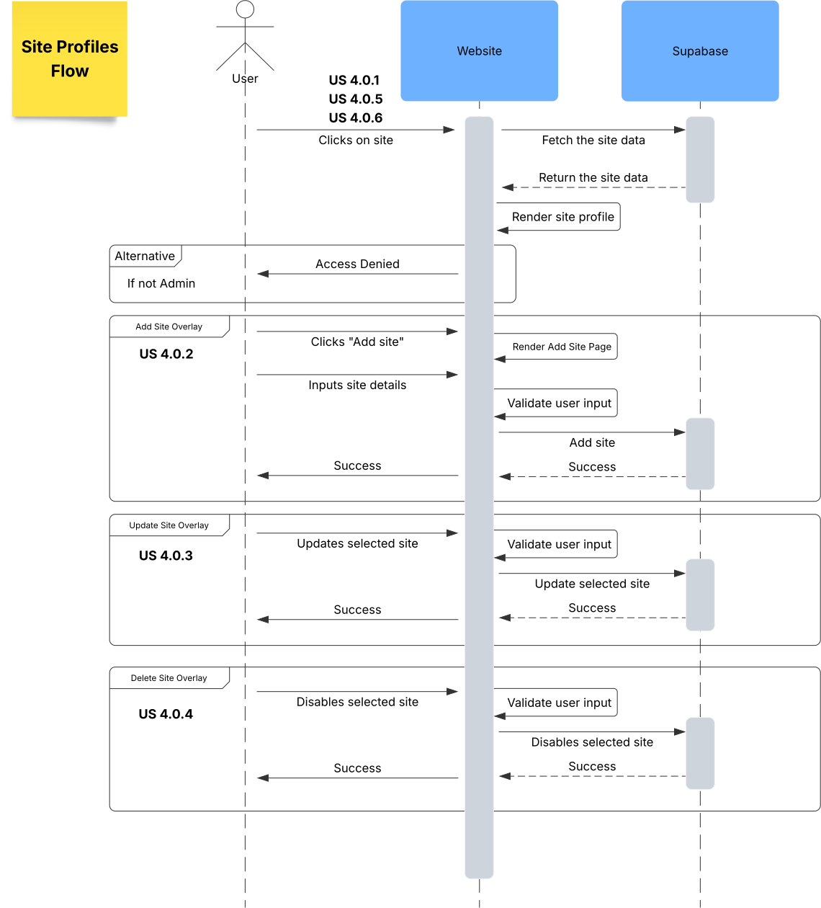
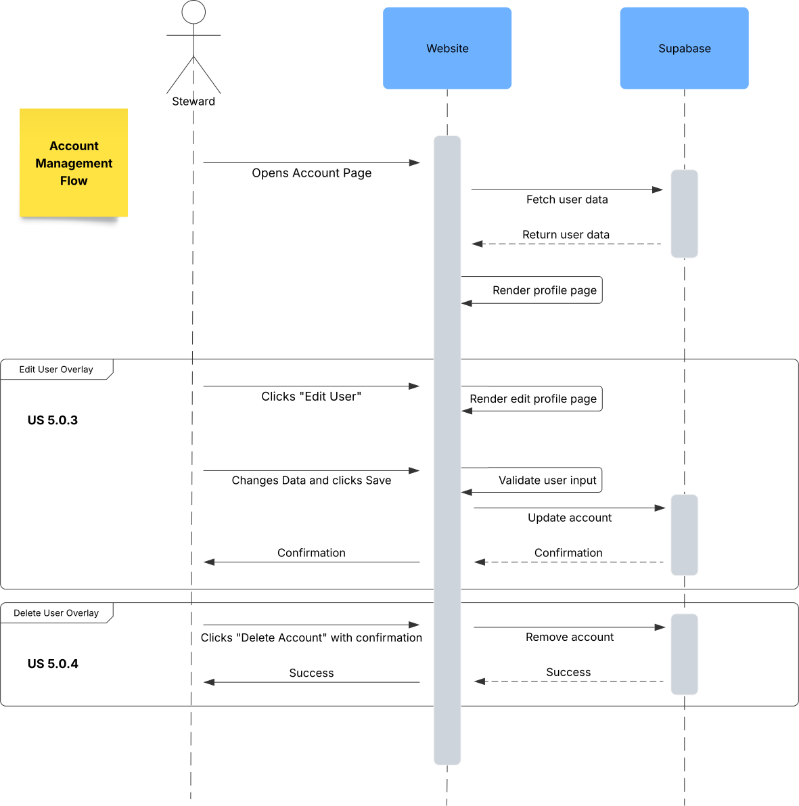
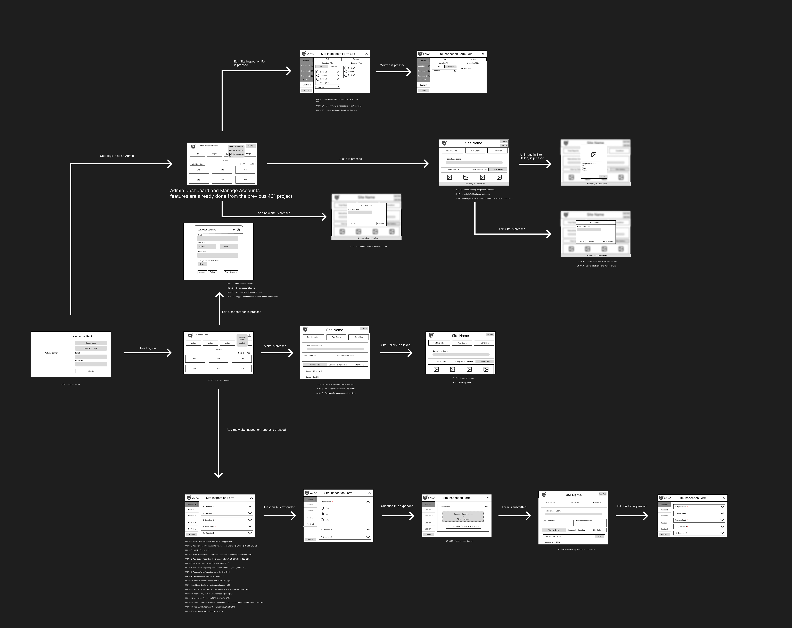

# Software Design

This page includes a short description of the overall architecture style of the system, its high-level system components, and their logical (what data they exchange) and control (how they invoke each other) dependencies.

## Architecture Diagram

This diagram provides a high-level understanding of the architecture involved in the project.

## ER Diagram for the database schema

[View it on Lucidchart](https://lucid.app/lucidchart/931f3cc9-cd72-4e46-9774-e4711ff0f562/edit?viewport_loc=-1219%2C-2790%2C4401%2C2199%2C0_0&invitationId=inv_aa3bd897-4385-4a31-a50a-6a9642316355)

## UML Class Diagram

This diagram is a description of logical entities of the domain through a UML diagram.

[View it on mermaid](https://mermaid.live/edit#pako:eNrlWv9v1DYU_1esSJOO7Vo6aEsbAVXHAUPiS-FASKPTyZf47jwSO9hOyw343_ccJ5fEsX0HY9K09Yf2Lv685_f9-Tn9FCU8JVEcJRmWckLxUuD8kqHq54cf0MOPigiGMzRdS0Vy2SxVcPSWzM-LAn1qnuqfu3dJTXP_fvf5c3i8_4dEPx-jm-gVwYlCP582gC-XrM_5GZ_TjOzM3PB7jhW9IsD-4ceCe1lPywLPsSS_4OQ9YeluG1xwqZaCTF8-RT-h81KtvOyf8gRngKOK7MaagLB78kMGBA6m4ANjCzQl4oomxHKBlqVe6W_305KoalFhRUY3UIw233owWc5lIuicvOYaMALpszmYRlO8YZvVHk3Gl5SNSI5pFiOpBGXLMSpAnGsu0uaJZjAlUlLO-hvSJSuLb6Wutn5L1eox58vMKBbEPaOJ4JIvVAjKS7N8xWnq9ewEqypwvOaeggvlC5ZRVssF36dlnmOxfvfj7zb6CZMFSRRIMyEKbNFQSqB6jnPStYSN7fEqixSc2kJqPnTzYEhv61rxSUlGQGDY_hUpuFABeQa0jfYbvYMKG1j73QXO8bJmV310QC7ShQHAh87ywG8vFgutiNttKb9mGceplvmXkqXZ7gpPalKStqr3n9lCJxnBEPtQnqhoqN4TUkzwWp7FiJX5nAjndjnQ4Wyy8ZDcSCkbMd_97qSk3Yicc65F8JrqPM0pC5eULHsjiTDa6k-2jjhN9eNt-T1GAkTpmtiSrROSFb8Sfj1JtxGYXHAQjFEl0NlQorO-SGeBLQb2upg88lmKEYGNrwA0Squ0GybiGCWcLegy1qweUZKlD6rvenMjRo9tIcgVJdffmatcYVHxW0CfucBq5Yv8gf5VarotUBY6DypAxTdGj-D3GLVlSTunDfkK6akCQRo7AE3MmI2p_r09aqrqtWQkfSMyF03fZv3uDGcgDMcUd3fWB6T_WYPW1E_sDj2oSi2q358HwF2bM1j6ZUnE-js156odrHV9HTGrFUypIv9YLwdeoIasmmRH2OaZo9hqcVqWzh1Nwjiys097zuS1ruzY_I03J2Wz4OkvAxHM4WEkiCxACdJm7Bhp4foZ7OqrD0ohCFO6iL-h6chTtKicKnKNRdoP1F2qts5K3ej-g03OLIHv-PwPcEfYGlC9zi-eoFeQYHbheky4Hgz1sjXECI3uTzCPH75GN3FBby4N1dmHe00Yen3wK8Eqx8VXbrAyVGfvyVrb-R7MU7lbsaniAuo4ZBtgFhi8PCoyzKDG37DGQQO8EPyKpkTY0tCGvi9RnUC9zlZYndMRtM1pc2RjNQdHUAxwnu6l-1Z4--FR7-20sVFP5b15CXOx6taQ_4ri1SwN_K1Y14lk1QCaOrXopXtvpZvnfpM3_d3eTeoVKHk0gcXUk_QgpSlG6DMU0CzzX3C0nc2hlqMZ6A6nE9apWcJLptbNkrW34WpKvy48Htjw3Gj1wN3kbI-Bs2_RZKbWBQkpMoPD1DbMdnPMGJyml9XY_XdsVuujSoEzBuesmUy42BlsJgMZhHNFggCaNvOFHwOq4tkKb4XgJCx7bQ_GQyBpGv4OkE58hFBLfawKehv8s-RiHWKWkgVlVPkdPrxI6l0S_Ety1Jy2sVTnCYwxkgzEcA9_3ytzdT9hjp4zHLnTxW57amt97W692T2ddc0VugPojNiWbO1x3FXTG7-51lqTTSopXJjmPO1aM4XMtdJUJ9eaTlYfFaQw1vLg7BzkuoKQ1_XDhe1UoqmpWltQk6ZcObVs0t61yOfQEa8quXzkuMD4KWXvPXZ-bsR4hovtk0Mzh-0Ygc31q794KKqyYEYq8jFYoT7UEm1tblTOBPlQ6ovHjZ7Oct1Mf82togu04CKH87c-kQSqrFH_dUBF78sZM3JaZm5GSl9Wb2zhWYdYmV3hrAzaSYMSnufbJW5fzej3VK9IZqJwRYvNAbN9jbW3d7_3riZGcKDz4OwXDSGsdbkdgg4ud0Pgzs1mCNa7AGyA_dsxv3Xq14eaj3VR1t-yj-td84SAvRnfC3RqMEB15mEvpjPSOizRDFvNGIr20PQ24ixbbwbSniiaoz2b9re2V-9-3t_vjnUxonmRkRwGC0uUegvFUf0StFns-qASwHpXGiPcefdpx6mbArJS0FbqQRR69tEwxNtgsQLdTSXXLOnoakXVdo3s8NpJIzvUdlSoEy5btum4rrZC4_uAcbrvoWOUY6Zv0kOe6xNAr0_lcHR2J7Jt5HbQ1YygvTIvtBpoB_I5HBfg6UDbbIMh25mXB7xdBIPpdTeq3CTlBhoMupBMLoLtMrmoNueZndBWc4Z0K-c57RYXRxxaw47DJ51W49WkCkYn3Dp-x_WrrxLOOWi-9hHBEBGj5qDfkcVZnfwxaqe9L-y67vTouMIbzoPVbviAevCsddTGhU4PmdNcxxTROFoKmkaxEiUZRzkROdZfo-qodRmpFTSMyyiGjzDY4jJTl9El-wJkBWa_cZ43lIKXy1UUL3Am4Zu5d67_f2gDgTpGxAM95ETxUcUhij9FH6P4zvH-wenp6cnx8fHJ0e2TQ1hcR_Gtg-P9w-M7JyeHhwe3jo-OTm9_GUd_Vnse7J8c3bl1eHrr6PT08OTO7QOgICmFKvis_v8l_efLX0d3X0w
)

## Sequence Diagrams

[View them on Lucidchart](https://lucid.app/lucidchart/97b40fe8-0ea1-4e2c-9118-472d71b630ff/edit?invitationId=inv_d023aae0-265e-478f-a9a1-b356599b6444&page=0_0#)

### Authentication

### Site Inspection Form

### Update Form

### Image Upload

### Gallery View

### Site Profiles

### Account Management

## Low-Fidelity User Interface

This is a low-fidelity projection of the end-product. The final design may take a different direction.

[View them on figma](https://www.figma.com/design/8WLN54CokqHyoJHdGFY6kd/SAPAA-UI?node-id=0-1&p=f&t=dd9Or2IMUNQLwult-0)

### This is a low-fidelity UI for the web app

### This is a low-fidelity UI for the mobile app

## List of Technologies Used
### Backend: Supabase + PostgreSQL + AWS
  * [Supabase Documentation](https://supabase.com/docs)  
  * [PostgreSQL Documentation](https://www.postgresql.org/docs/) 
  * [Amazon S3](https://docs.aws.amazon.com/AmazonS3/latest/userguide/Welcome.html) 

### Cloud Infrastructure & Cost Control
  * [AWS IAM](https://docs.aws.amazon.com/iam/)
  * [AWS Budgets & Billing Alerts](https://docs.aws.amazon.com/cost-management/)

### Deployment: Cybera
  * [Cybera Documentation](https://wiki.cybera.ca/spaces/RAC/pages/8880558/Rapid+Access+Cloud)

### Mobile: React Native
  * [React Native Documentation](https://reactnative.dev/docs/getting-started)
  * [PDF.js Documentation](https://mozilla.github.io/pdf.js/)  

### Testing & Tools
  * [Jest Testing Framework](https://jestjs.io/)
  * [Postman](https://www.postman.com/) for API testing  