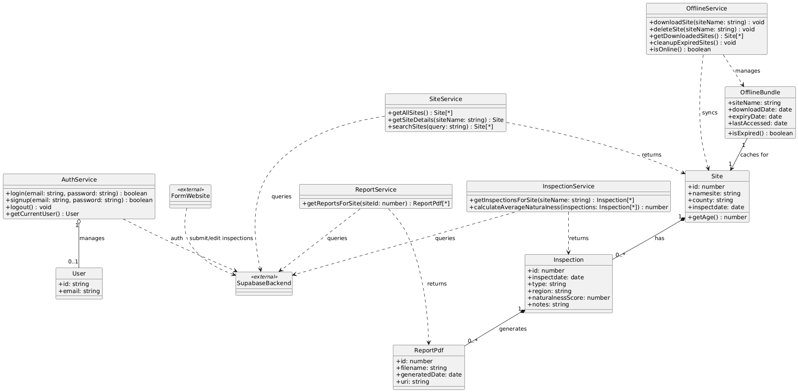

# Software Design

This page includes a short description of the overall architecture style of the system, its high-level system components, and their logical (what data they exchange) and control (how they invoke each other) dependencies.

## Architecture Diagram

This diagram provides a high-level understanding of the architecture involved in the project.

## UML Class Diagram

This diagram is a description of logical entities of the domain through a UML diagram.

# Sequence Diagrams

[View them on Lucidchart](https://lucid.app/lucidchart/97b40fe8-0ea1-4e2c-9118-472d71b630ff/edit?invitationId=inv_d023aae0-265e-478f-a9a1-b356599b6444&page=0_0#)

### Authentication

### Site Inspection Form

### Update Form

### Image Upload

### Gallery View

### Site Profiles

### Account Management

## Low-Fidelity User Interface

This is a low-fidelity projection of the end-product. The final design may take a different direction.

### This is a low-fidelity UI for the web app

### This is a low-fidelity UI for the mobile app

## List of Technologies Used
### Backend: Supabase + PostgreSQL + Django REST Framework
  * [Supabase Documentation](https://supabase.com/docs)  
  * [PostgreSQL Documentation](https://www.postgresql.org/docs/) 
  * [psqlODBC Driver Documentation](https://odbc.postgresql.org/)  
  * [Django REST Framework Documentation](https://www.django-rest-framework.org/)

### Deployment: Cybera
  * [Cybera Documentation](https://wiki.cybera.ca/spaces/RAC/pages/8880558/Rapid+Access+Cloud)

### Mobile: React Native
  * [React Native Documentation](https://reactnative.dev/docs/getting-started)
  * [PDF.js Documentation](https://mozilla.github.io/pdf.js/)  

### Testing & Tools
  * [Jest Testing Framework](https://jestjs.io/)
  * [Postman](https://www.postman.com/) for API testing  