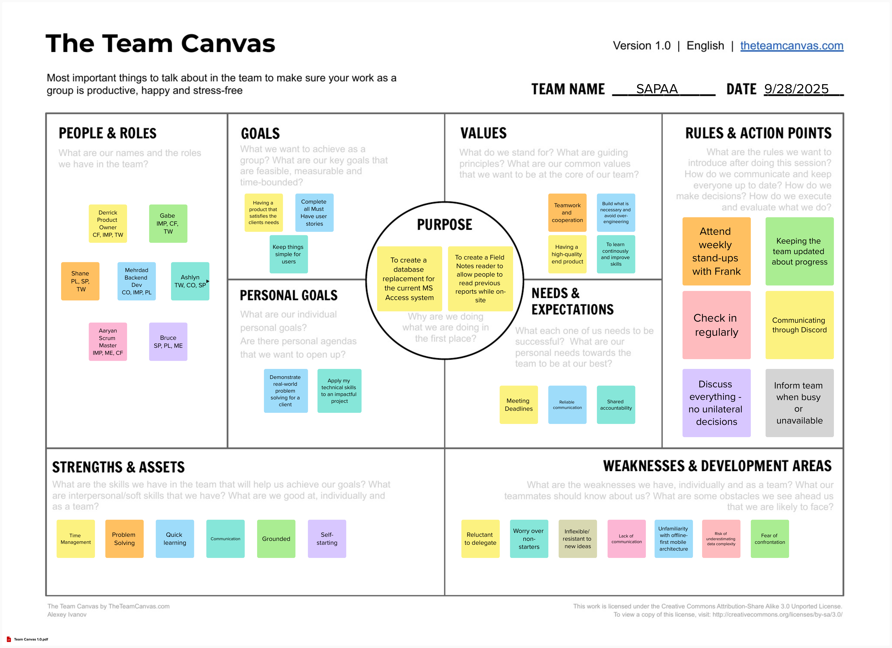

# Teamwork
This page provides an overview of the team and its members.

## Team Canvas

## Scrum Roles
Currently, we have opted to maintain scrum roles for the entire project. We will make an update here if we decide in the future to rotate either one or both of these roles with each sprint.

|Role           |Name           |
|---------------|-------------- |
|Scrum Master   |Aaryan Shetty  |
|Product Owner  |Derrick Chen   |

## Belbin Roles
Source: [https://www.belbin.com/about/belbin-team-roles](https://www.belbin.com/about/belbin-team-roles)

|Name                   |Preferred Roles    |Manageable Roles   |Least Preferred Roles  |
|-----------------------|-------------------|-------------------|-----------------------|
|Aaryan Shetty          |IMP, ME, CF        |CO, SH, TW         |RI, SP, PL             |
|Ashlyn Benoy           |TW, CO, SP         |IMP, CF, RI        |SH, PL, ME             |
|Bruce Tong             |SP, PL, ME         |CF, IMP, SH        |TW, RI, CO             |
|Derrick Chen           |CF, IMP, TW        |SH, ME, SP         |CO, PL, RI             |
|Gabriel Bautista       |IMP, CF, TW        |SP, ME, RI         |CO, PL, SH             |
|Mehrdad Matin Panah    |CO, IMP, PL        |TW, CF, SP         |ME, RI, SH             |
|Seyi (Shane) Bamijoko  |PL, SP, TW         |IMP, CF, ME        |RI, SH, CO             |

### Thinking Roles

#### PL (Plant)
> Tends to be highly creative and good at solving problems in unconventional ways.

1. Seyi (Shane) Bamijoko (Preferred)
2. Mehrdad Matin Panah (Preferred)

#### ME (Monitor Evaluator)
> Provides a logical eye, making impartial judgements where required and weighs up the team's options in a dispassionate way.

1. Aaryan Shetty (Preferred)
2. Bruce Tong (Preferred)

#### SP (Specialist)
> Brings in-depth knowledge of a key area to the team.

1. Seyi (Shane) Bamijoko (Preferred)
2. Bruce Tong (Preferred)

### Action Roles
#### SH (Shaper)
> Provides the necessary drive to ensure that the team keeps moving and does not lose focus or momentum.

1. Aaryan Shetty (Manageable)
2. Derrick Chen (Manageable)

#### IMP (Implementer)
> Needed to plan a workable strategy and carry it out as efficiently as possible.

1. Aaryan Shetty (Preferred)
2. Gabriel Bautista (Preferred)

#### CF (Completer Finisher)
> Most effectively used at the end of tasks to polish and scrutinise the work for errors, subjecting it to the highest standards of quality control.

1. Derrick Chen (Preferred)
2. Gabriel Bautista (Preferred)

### People Roles
#### RI (Resource Investigator)
> Uses their inquisitive nature to find ideas to bring back to the team. 

1. Ashlyn Benoy (Manageable)
2. Gabriel Bautista (Manageable)

#### TW (Teamworker)
> Helps the team to gel, using their versatility to identify the work required and complete it on behalf of the team.

1. Ashlyn Benoy (Preferred)
2. Derrick Chen (Preferred)

#### CO (Co-ordinator)
> Needed to focus on the team's objectives, draw out team members and delegate work appropriately.

1. Mehrdad Matin Panah (Preferred)
2. Ashlyn Benoy (Preferred)